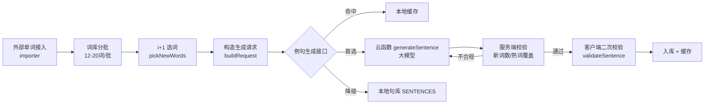

# 可理解输入（i+1）改造方案

## 一、总体架构



**两条硬规则**：任何例句出口（AI / 本地语料）都必须通过 `validateSentence`；任何单词入口都必须经过 `validateAndDedupe`。

---

## 二、数据结构

### 1. 词书与批次（`data/wordbooks.js`）

```js
{
  id: 'fj_zsb_core',
  name: '核心词书',
  batches: [
    { id: 'batch-1',  index: 0,  name: '入门高频词 · 第 1 组', level: 1, wordIds: [1..16, 65..68] },
    { id: 'batch-2',  index: 1,  name: '入门高频词 · 第 2 组', level: 1, wordIds: [69..88] },
    // …… 共 32 批（640 词 / 每批 20 词），Lv1-Lv4 各 8 批
    { id: 'batch-32', index: 31, name: '冲刺高频词 · 第 8 组', level: 4, wordIds: [...] }
  ]
}
```
- **固定切片**：`buildBatches()` 先按 `(lv, id)` 升序排序，再按 `BATCH_SIZE = 20` 切片 —— 词库扩容也不会出现"半批跨档"或批次失衡
- 当前规模：**640 词 / 32 批 / 626 句**例句（每词至少 1 句，部分 2-5 句）
- 解锁规则：上一批掌握率 ≥ 70% 才开放下一批（`wordbook.batchProgress`）

### 2. 掌握状态（存储，按词书维度隔离）

```js
state = {
  currentBook: 'fj_zsb_core',
  books: {
    fj_zsb_core: { mastery: { [wordId]: { m: 0-5, seen: n, correct: n } } },
    custom_inbox: { mastery: { ... } }
  },
  customWords: { custom_inbox: [ { id, word, pos, meaning, lv, exampleEn, exampleZh, exampleSid } ] },
  fj_sentence_cache: { '<签名>': { ts, data } }
}
```
- `m` 判定：0-2 = 新词（待学 i+1 的"+1"），3 = 熟悉，**≥3 进熟词池**，≥4 = 已掌握
- 旧数据 `state.mastery` 首次读取时自动迁入默认词书（`wordbook.ensureShape`）

### 3. 例句对象

```js
{ sid, en, zh, newWords: ['improve'], scene: '校园生活', source: 'ai|cache|corpus', metrics: {...} }
```

---

## 三、例句生成接口契约

### 输入 `request`（`iplus1.buildRequest` 产出）

| 字段 | 类型 | 约束 |
| --- | --- | --- |
| bookId | string | 必填，决定熟词池与批次 |
| newWords | `[{word,pos,meaning}]` | **1-3 个**，超出直接拒绝 |
| knownWords | `string[]` | 例句主干只能从这里取（上限 120，冷启动自动补最低等级词） |
| scene | string | 10 个日常场景之一 |
| constraints | object | `newWordCount`、`maxNewWords:3`、`sentenceLength:[8,30]`、`style:['idiomatic','daily','colloquial']`、`forbid` |
| excludeSids | string[] | 避免近期重复 |

### 输出 `sentence`

`{ sid, en, zh, newWords, scene, source, metrics }`；`source='none'` 表示三级供给全部失败，调用方应跳过该词而不是展示空题。

### 校验规则（`iplus1.validateSentence`，服务端同规则）

| 检查项 | 阈值 |
| --- | --- |
| 长度 | 8-30 词 |
| 目标词命中 | 全部出现（允许词形变化，stem 前缀匹配） |
| **主干熟词覆盖率** | **≥ 70%**（除目标词与新词外的实词命中熟词池比例） |
| **生词堆砌** | 非熟词池且非目标词的实词 **≤ 1** |
| 中文释义 | ≥ 6 字、不含长串英文残留 |

不合规 → 把 `reasons` 作为 feedback 回传给生成端重试（最多 2 次）→ 仍失败降级本地语料。

---

## 四、外部单词接入流程

### 接收方式
| 端 | 方式 |
| --- | --- |
| App(Android) | manifest `android.intent.action.SEND` + `text/plain`；运行时取 `plus.runtime.arguments` |
| 微信小程序 | 无系统级分享入口 → 用「粘贴文本」：`uni.getClipboardData()`；可额外支持从聊天会话选取文件 |
| H5 | 粘贴框 / URL 参数 |

### 处理管道（`importer.importPipeline`）

1. **解析 parseSharedText**：依次尝试 JSON → CSV → 逐行文本；剥离行号、音标、例句碎片；支持 `word | pos | meaning` / `word\t释义` / `word 释义`
2. **清洗 normalizeItem**：小写化、去空格，词形正则 `^[a-zA-Z][a-zA-Z'-]{1,19}$`
3. **校验 validateAndDedupe**：
   - 词形非法 / 非英文 / 缺释义 → rejected
   - 与主词库、目标词书已有词比对 → 去重（含本次内部重复）
4. **归书 importIntoBook**：写入 `state.customWords[bookId]`；缺省词性按后缀猜测（`tion/ness→n.`，`ize/ify→v.` 等）
5. **生成例句 generateForImported**：为每个新词构造 `newWordCount=1` 的请求，串行 300ms 限速批量生成，回写 `exampleEn/exampleZh`
6. **回执**：`{ parsed, accepted, rejected, added, examples }`，UI 展示"新增 N 词、跳过 M 词（附原因）"

---

## 五、改造后的答题主链路

```js
const req = iplus1.buildRequest(currentBookId, { newCount: 1 })
const sentence = await generateSentence(req)      // ai → cache → corpus
// 出题：sentence.en / sentence.zh 双向随机
// 判分后：iplus1.recordMastery(bookId, wordIds, status)
//         → 掌握度变化 → 下一轮 pickNewWords 自动推出新的一批"+1"词
```

## 六、2026-10 迭代要点（语音 / 点读 / 扩容）

### 语音 `utils/tts.js`
- 有道 `dictvoice` **只对词典里有条目的文本返回音频**：单词与部分短语 200，多数完整句子 500 → 旧实现"重听无反应"的根因
- 现为**两级供给**：整句先请求一次，失败自动降级为**逐词（中文逐字）串行连读**
- 每个播放单元新建 `InnerAudioContext`，播完立即 `destroy()`（规避 -99 与 H5 `<audio>` 堆积）；`gen` 代际 token 保证 `stop()` 后在途回调不误触发
- 去重只作用于"自动朗读且同文本正在播"；用户主动点击（`force`）永不节流
- 失败不再静默：全部失败 toast「发音服务不可用，请检查网络」，部分失败提示「N 个词暂无发音」

### 点读 `utils/dict.js` + `utils/lemma.js` + `data/common-words.js`
- 查词优先级：核心词书 → 用户导入词 → 内置常用词典（986 条）→ 词形还原后再查 → 未收录（仍可发音）
- 词形还原返回候选数组：`improving→improve`、`studies→study`、`knives→knife`、`went→go`、`possibly→possible`
- 句库 token 覆盖：类型 88% / 实例 97%（`_tools/check-coverage.js` 输出未收录 Top，直接照着补词典）
- 练习页**题干 / 参考答案 / 四个选项**全部 token 化；未作答点单词 = 选中该选项，已作答点单词 = 弹词义 + 发音（`@tap.stop` 阻止冒泡）

### 抽题 `utils/sentence-index.js` + `pickFromCorpus`
- 626 句全表扫描改为倒排索引（2279 个键，惰性构建 ~30ms）
- **前三级兜底硬性要求命中目标新词**，只有最后一级才放宽并标记 `degraded`
- 同一组内轮换目标词（`excludeWordIds`），10 题围着 10 个不同新词，避免"10 题同一个词"
- `fallbackQuestion` 排除本会话已用 sid；干扰项改走 `sentenceIndex.neighbours(lv)`

## 七、待落地事项
- 云函数需在 uniCloud 或自建 Node 服务部署，并配置 `MODEL_API_URL / MODEL_API_KEY / MODEL_NAME`
- App 端分享入口需在 manifest 的 `app-plus.distribute.android.intentFilters` 中声明
- `vocab / stats` 页仍读旧的扁平 `state.mastery`，与首页的词书维度口径不同，待统一
- 例句可继续扩充（当前每词 1-2 句，目标是 2-3 句）
